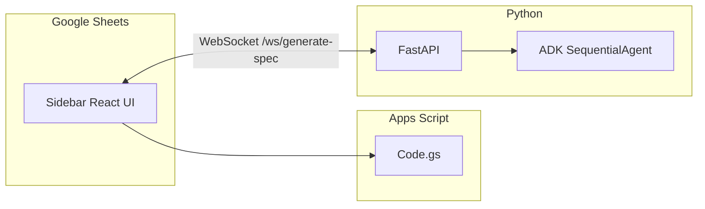

# RTM-to-Spec Agent

Google Sheets sidebar that turns **requirements / RTM-style rows** into **enhanced technical specifications**. A React UI runs inside Apps Script, talks to a **FastAPI** backend over **WebSocket**, and uses **Google ADK** with a sequential multi-agent pipeline (intent understanding → gap detection → specification generation) backed by **LiteLLM** (e.g. LM Studio or any OpenAI-compatible server).

## How it works

1. **Setup** — Pick a header row, then choose which columns to track (the data merged into each “ticket”).
2. **Select** — In the sheet, select the rows you want to enhance. Exactly **one** tracked column must fall inside the selection; the **leftmost column** of the range receives the generated spec.
3. **Enhance** — The sidebar streams model output, then writes the final text into the sheet. Optional **Additional details** are appended to the prompt.



## Repository layout

| Path | Purpose |
|------|---------|
| `src/` | FastAPI app, WebSocket handler, ADK agents |
| `react/` | Vite + React sidebar (single-file build) |
| `appscript/` | Apps Script project: `Code.gs`, built `index.html`, `appsscript.json` |
| `run_server.sh` | Run `uvicorn` with optional `.venv` and `.env` |

## Prerequisites

- **Python** 3.11+ (recommended)
- **Node.js** 20+ for the React build
- An **OpenAI-compatible** inference endpoint (default: LM Studio)
- **Google account** with Apps Script / Sheets

## Backend

```bash
cd "/path/to/RTM-to-Spec Agent"
python -m venv .venv
source .venv/bin/activate   # Windows: .venv\Scripts\activate
pip install -r requirements.txt
cp .env.example .env        # edit LM_STUDIO_API_BASE, keys, models as needed
./run_server.sh
```

By default the API listens on `http://127.0.0.1:8000`.

### Environment variables (server)

| Variable | Purpose |
|----------|---------|
| `LM_STUDIO_API_BASE` | OpenAI-compatible base URL (e.g. `http://host:port/v1`) |
| `LM_STUDIO_API_KEY` | Optional; omit if the server needs no auth |
| `QWEN_MODEL` | LiteLLM model id (default `openai/local-model`) |
| `DEEPSEEK_MODEL` | Reserved for alternate routing in `agents.py` |
| `HOST`, `PORT`, `RELOAD` | Optional overrides for `run_server.sh` |

### HTTP and WebSocket

- **WebSocket** `ws://127.0.0.1:8000/ws/generate-spec` — JSON messages with `ticket`, `user_id`, `session_id`; streaming `chunk` / `text` events, then `complete`.
- **POST** `/generate-spec` — Same payload, non-streaming JSON response.

Payload shape (`src/models.py`): `ticket` (string), optional `user_id`, `session_id`.

## Frontend (sidebar UI)

```bash
cd react
yarn install
```

For **local dev** (browser only, mocks `google.script.run`):

```bash
yarn dev
```

For **Apps Script**, set the WebSocket URL at **build time** (embedded in the bundle), then copy the build into the script project:

```bash
npm run build
```

Copy `react/dist/index.html` into `appscript/index.html` (replacing the deployed HTML). Keep `Code.gs` and `appsscript.json` in sync with the repo.

**Production tip:** Serve the API over **HTTPS** so the sidebar can use **WSS**. Mixed content or tunnel issues often show up as WebSocket close code `1006`.

## Google Apps Script
1. Add files from `appscript/`: `Code.gs`, `index.html` (built), `appsscript.json`.
2. Deploy / refresh the add-on; use the menu **Agents → Technical Specification Enhancer Agent** to open the sidebar.

OAuth scopes are defined in `appsscript.json` (spreadsheet, external request, UI).
